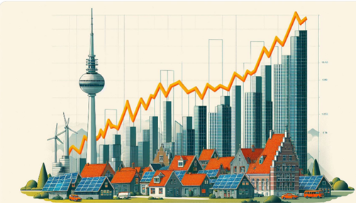

# Energy Transition Blog
## Holanda 2, Ecuador 0! 
##### by Remigio Peñarreta  
###### Ottawa, 15.05.2024

Y no es el marcador del último partido contra Holanda, como llamamos en el lenguaje futbolístico a Países Bajos.
Hace dos años planteamos la posibilidad y necesidad de instalar 2GW solares en el Ecuador como medida para superar la crisis energética.  La razón es sencilla: La energía solar es ***competitiva en precio y de rápida instalación*** (si se excluyen el tortuguismo estatal y la visión obsesiva de control del estado en materia energética) , por otro lado tenemos suficiente almacenamiento hidro-eléctrico para manejar la intermitencia de la energía solar. 

Volvamos al marcador, pues bien, Holanda nos ha casi goleado el año pasado instalando más de 2 GW fotovoltaicos solo en techos, de acuerdo con PV Magazine y el “Nationaal Solar Trendrapport 2023”.

Cuando planteamos en 2022 esta opción (de instalar 2GW en Ecuador) tuve varias respuestas del público: 
Los “believers” (no los de Justin Bieber), nos felicitaron y repostearon la propuesta.

Los “non-believers”, dijeron que era imposible hacer eso; la mayoría de ellos adujeron razones técnicas como la falta de líneas de transmisión, o riesgos para el sistema eléctrico o tiempo de ejecución, o impacto ambiental, o falta de firmeza en potencia, etc. etc. 

Si bien es cierto dichas objeciones eran infundadas o imprecisas, lo cierto es que después de dos años casi nada ha pasado en el tema: 0 GW solares instalados en Ecuador.

He querido encontrar una explicación de por qué Holanda si y Ecuador no, y se me ocurrió ver las diferencias no futbolísticas entre los dos países: 

- Países Bajos tiene la misma población que Ecuador.
- Países Bajos tiene una economía y PIB per cápita ~10 veces mayor.
- Tiene una economía abierta y dinámica (exporta ~25 veces más que Ecuador).
- Ha promovido activamente el desarrollo de sistemas de generación distribuida. 
- Tiene ~2 años más de escolaridad que en el Ecuador.
- Países Bajos consume ~4 veces más electricidad que el país Sudamericano.
- El país europeo implementó hace varios años incentivos como:
    - Devolución de impuestos por uso de energía renovable para las personas naturales que se unen para generar su propia electricidad sostenible (comunidades solares).
    - Programa de subvenciones para energías renovables (SDE+), dirigido a empresas y organizaciones.
    - Ayudas financieras a la inversión en energía sostenible (ISDE) para las empresas y los particulares.
    - Algunos de estos incentivos se han eliminado en 2024 gracias al gran avance de la energía solar en dicho país.  

Por otro lado, Ecuador:
Tiene un área 6 veces más grande. 
- Tiene 10 veces más biodiversidad (por poner un número).
- Tiene un 40% más de irradiación solar anual promedio que Países Bajos.
- El costo de la energía eléctrica residencial en Ecuador es similar al de Países Bajos, mientras que la energía industrial es más barata que en el país europeo (8 vs 10 ȼUSD/kWh aprox.).
- Ecuador tiene algunos incentivos como cero IVA (similar a Países Bajos) y reducción de impuestos para inversiones en energía renovable solar (vía escudos fiscales).

Viendo esas diferencias, me ha sido difícil encontrar una razón para el 2-0, pues tenemos más área, más irradiación solar y más urgencia de instalar capacidad eléctrica adicional.

Solo me queda hacer la siguiente hipótesis …
Holanda nos golea, “fotovoltaicamente” hablando, porque en el Ecuador:

- Se restringe la instalación de nuevas plantas de energía renovable distribuida con subsidios perversos, normativas complejas y procedimientos engorrosos que desincentivan la iniciativa privada y el crecimiento del sector (ver nuevas leyes y normativas).
- Los lideres políticos no apoyan de manera clara y consistente el desarrollo de estas tecnologías (ej. 2 años sin ejecutarse proyectos adjudicados en últimas subastas de energía renovable).
- Las autoridades y agentes de control del sector eléctrico tienen temor de perder el control y el monopolio de la generación, por lo que prefieren contener la iniciativa privada y tenernos en tinieblas esperando que venga algún gobierno manisuelto que continue sobre- endeudando el país con nuevos proyectos energéticos faraónicos.
- Se subsidia fuertemente el costo de la electricidad industrial y comercial (en detrimento de la energía renovable privada) por lo que se requiere incentivos adicionales para que la energía solar despegue: ej.: tarifas especiales para la compra de energía renovable (“Feed-in Tariff”) y simplificación drástica de procesos de aprobación e implementación.

Es fundamental y urgente que los actores del sector eléctrico (públicos y privados) nos veamos en el espejo sin maquillaje, aceptando los errores cometidos y replanteándonos nuevos modelos de desarrollo alejados del fundamentalismo político y las mentalidades renuentes al cambio, para así poder salir del atolladero y terminar con los apagones consuetudinarios. 

#
#

##### *Nota Biográfica del Autor del Artículo:
#### Remi.Penarreta@gmail.com
#### Telf. +1 613 413 5494 
###### ***Remigio Peñarreta Chauvin*** es Máster en Ingeniería Eléctrica (Universidad Politécnica de Odessa, Ucrania), Máster en Gestión de Empresas Tecnológicas (USFQ), Diplomado en Supply Management & Logistics (Tec. de Monterrey), egresado MBA (EPN), y actualmente estudiante de PhD en Transición Energética (Universidad de Carleton, Ottawa). Con más de 25 años de experiencia en gestión y dirección en empresas multinacionales de soluciones de generación eléctrica en Latinoamérica y el Caribe; fundó a finales de 2019 Gosolar S.A., empresa de consultoría e ingeniería enfocada en promover el uso de energías renovables y soluciones modernas de almacenamiento de energía en Sudamérica.

